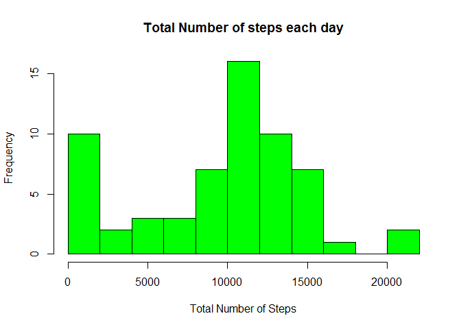
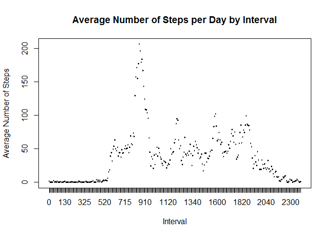
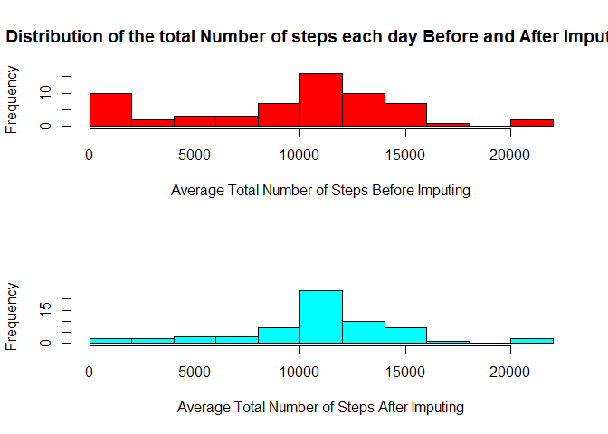

# Reproducible Project
Joel Samson  
February 26, 2018  

### Download data, unzip, read 

```r
tmp <- tempfile()
download.file("https://d396qusza40orc.cloudfront.net/repdata%2Fdata%2Factivity.zip", tmp)
unzip(tmp, "activity.csv")
Newactivity <- read.table("activity.csv", sep=",", header=T)
```

### Take a copy of data and format the field date as date format 

```r
activityCopy <- Newactivity
str(Newactivity$date)
Newactivity$Date <- as.Date(Newactivity$date, "%Y-%m-%d")
Newactivity$interval <- as.factor(Newactivity$interval)
l <- levels(Newactivity$interval)
```

### 1) What is mean total number of steps taken per day?

Total number of steps taken each day

```
##          date steps
## 1  2012-10-02   126
## 2  2012-10-03 11352
## 3  2012-10-04 12116
## 4  2012-10-05 13294
## 5  2012-10-06 15420
## 6  2012-10-07 11015
## 7  2012-10-09 12811
## 8  2012-10-10  9900
## 9  2012-10-11 10304
## 10 2012-10-12 17382
## 11 2012-10-13 12426
## 12 2012-10-14 15098
## 13 2012-10-15 10139
## 14 2012-10-16 15084
## 15 2012-10-17 13452
## 16 2012-10-18 10056
## 17 2012-10-19 11829
## 18 2012-10-20 10395
## 19 2012-10-21  8821
## 20 2012-10-22 13460
## 21 2012-10-23  8918
## 22 2012-10-24  8355
## 23 2012-10-25  2492
## 24 2012-10-26  6778
## 25 2012-10-27 10119
## 26 2012-10-28 11458
## 27 2012-10-29  5018
## 28 2012-10-30  9819
## 29 2012-10-31 15414
## 30 2012-11-02 10600
## 31 2012-11-03 10571
## 32 2012-11-05 10439
## 33 2012-11-06  8334
## 34 2012-11-07 12883
## 35 2012-11-08  3219
## 36 2012-11-11 12608
## 37 2012-11-12 10765
## 38 2012-11-13  7336
## 39 2012-11-15    41
## 40 2012-11-16  5441
## 41 2012-11-17 14339
## 42 2012-11-18 15110
## 43 2012-11-19  8841
## 44 2012-11-20  4472
## 45 2012-11-21 12787
## 46 2012-11-22 20427
## 47 2012-11-23 21194
## 48 2012-11-24 14478
## 49 2012-11-25 11834
## 50 2012-11-26 11162
## 51 2012-11-27 13646
## 52 2012-11-28 10183
## 53 2012-11-29  7047
```

Mean and Median of steps taken each day

```
## [1] 10766.19
```

```
## [1] 10765
```

### Draw the histograms for Total Number of Steps By Each Day
<!-- -->

### 2) What is the average daily activity pattern?
1.Make a time series plot (i.e. ) of the 5-minute interval (x-axis) and the average number of steps taken, averaged across all days (y-axis)
<!-- -->

2.Which 5-minute interval, on average across all the days in the dataset, contains the maximum number of steps?

```
## [1] 835
## 288 Levels: 0 5 10 15 20 25 30 35 40 45 50 55 100 105 110 115 120 ... 2355
```

### 3) Imputing missing values
Total Number of Missing values: 

```
## [1] 2304
```

Summary of Before and After Imputing missing values

```
##    Min. 1st Qu.  Median    Mean 3rd Qu.    Max. 
##       0    6778   10395    9354   12811   21194
```

```
##    Min. 1st Qu.  Median    Mean 3rd Qu.    Max. 
##      41    9819   10766   10766   12811   21194
```

<!-- -->

### 4) Are there differences in activity patterns between weekdays and weekends?
<!-- -->
